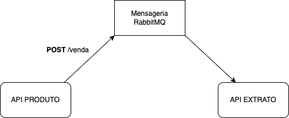

# Express Product Sale 

## Descrição
Serviço para gerenciamento de produtos, estoque e Vendas com fila RabbitMQ.

## Tecnologias
* [NodeJS](https://nodejs.org/)
* [Typescript](https://www.typescriptlang.org/)
* [Express](https://expressjs.com/)
* [RabbitMQ](https://www.rabbitmq.com/)
* [PostgreSQL](https://www.postgresql.org/)
* [PrismaORM](https://www.prisma.io/)
* [Docker](https://www.docker.com/)

## Executar o projeto

Executar ```docker-compose up```  Levanta todos os containers:
- API Produto;
- API Extrato;
- RabbitMQ;
- Postgres;

## Endpoints - API Produto

| Tipo | Endpoint | Descrição |
| --- | --- | --- |
| POST | /produto | Cadastra um produto |
| GET | /produto | Lista os produtos |
| GET | /produto/:id | Lista um produto por id |
| PATCH | /produto/:id | Atualiza um produto |
| DELETE | /produto/:id | Deleta um produto |  
| POST | /estoque | Cadastra um estoque |
| GET | /estoque | Lista os estoques |
| GET | /estoque/:id | Lista um estoque por id |
| PATCH | /estoque/:id | Atualiza um estoque |
| DELETE | /estoque/:id | Deleta um estoque |
| POST | /venda | Realizar uma venda |
| GET | /venda | Listar vendas |

## Endpoints - API Extrato
| Tipo | Endpoint | Descrição |
| --- | --- | --- |
| GET | /extrato | Listar os extratos |

> Para testar os endpoints com o postman importar a collection: ```docs/collection.json```. 
  

## Organização das API's



## Organização do projeto
* **Controllers**: Responsável por lidar com as requisições e respostas;  
* **Services**: Responsável por lidar com as regras de negócios;  
* **Repositories**: Responsável por lidar com as transações com banco de dados;  
* **DTO**: Objeto simples usado para transferir dados de um local a outro na aplicação;  

## Veja mais
Para mais informações : [brenomachado.dev](https://brenomachado.dev)
